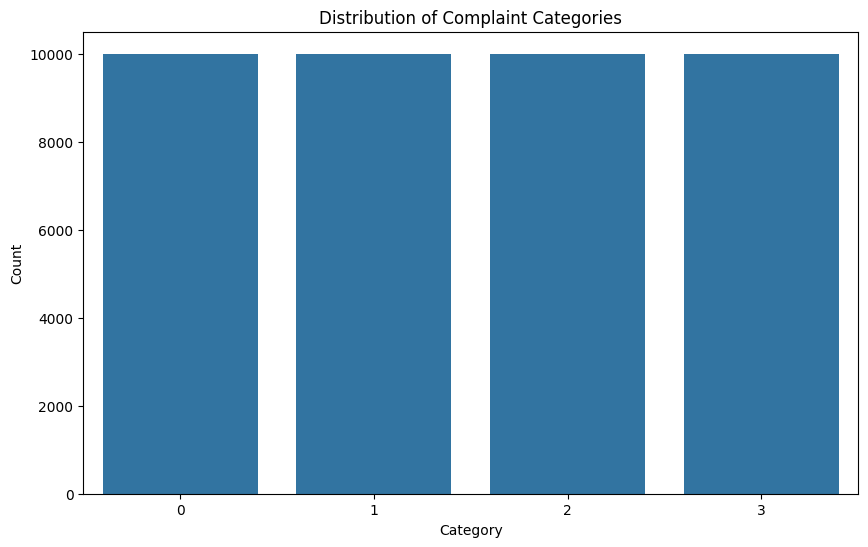
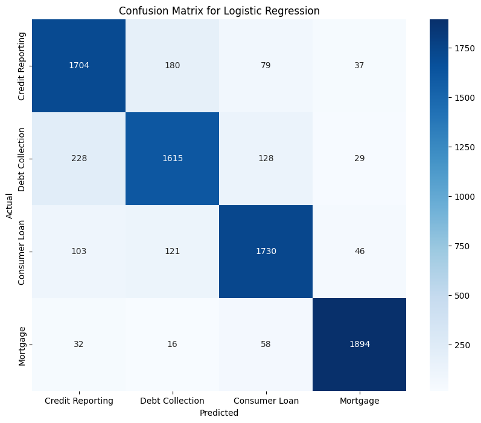

# Complaint Classification using Machine Learning

This project classifies consumer complaints into different categories using machine learning models such as Multinomial Naive Bayes, Logistic Regression, and Linear SVC. The dataset is sourced from the [Consumer Financial Protection Bureau (CFPB)](https://www.consumerfinance.gov/data-research/consumer-complaints/).

## Table of Contents

1. [Project Overview](#project-overview)
2. [Dataset Information](#dataset-information)
3. [Getting Started](#getting-started)
    - [Download Dataset](#download-dataset)
    - [Set Up Environment](#set-up-environment)
4. [Approach](#approach)
5. [Model Training and Evaluation](#model-training-and-evaluation)
6. [Results](#results)
7. [Usage](#usage)
8. [Future Work](#future-work)

## Project Overview

The goal of this project is to classify consumer complaints into one of four categories:

1. Credit Reporting, Repair, or Other
2. Debt Collection
3. Consumer Loan
4. Mortgage

We use Natural Language Processing (NLP) techniques, including TF-IDF feature extraction, and evaluate three different machine learning models.

## Dataset Information

The dataset is obtained from the CFPB and contains consumer complaints related to financial products and services.

Key columns used in this project:
- `Product`: The category of the financial product.
- `Consumer complaint narrative`: The text of the consumer's complaint.

## Getting Started

### Download Dataset

For Google Colab, you can directly download and unzip the dataset:

```bash
!wget https://files.consumerfinance.gov/ccdb/complaints.csv.zip
!unzip /content/complaints.csv.zip
```

Alternatively, you can manually download the dataset from [CFPB's website](https://www.consumerfinance.gov/data-research/consumer-complaints/) and upload it to your working directory.

### Set Up Environment

Ensure you have the necessary Python libraries installed:

```bash
pip install pandas numpy scikit-learn seaborn matplotlib
```

## Approach

1. **Data Preprocessing:**
   - Remove rows with missing narratives.
   - Map financial products to specified categories.
   - Balance the dataset by sampling a maximum of 10,000 complaints per category.

2. **Feature Engineering:**
   - Extract text features using TF-IDF (unigrams and bigrams).

3. **Model Training:**
   - Train and evaluate three models: Multinomial Naive Bayes, Logistic Regression, and Linear SVC.

4. **Evaluation:**
   - Compare models based on accuracy.
   - Display the best model and confusion matrix.

## Model Training and Evaluation

We evaluate the following models:

1. **Multinomial Naive Bayes**
2. **Logistic Regression** (with L-BFGS solver)
3. **Linear SVC**

Performance metrics include:
- Accuracy
- Classification Report (Precision, Recall, F1-score)
- Confusion Matrix

### Example Output:

1. **Category Distribution**



2. **Confusion Matrix for Best Model**



## Results

The Linear SVC model achieved the best accuracy in our evaluation. Example output from the model includes:

```
Best Model: Logistic Regression with Accuracy: 0.87
```

Sample Prediction:

Input: "I have an issue with my credit report being inaccurate."

Output: "Predicted Category: Credit Reporting, Repair, or Other"

## Usage

You can modify the script to predict new consumer complaints by updating the `new_complaint` variable.

Example:

```python
new_complaint = ["I am facing an issue with my mortgage payment."]
predicted_category = svc.predict(vectorizer.transform(new_complaint))
print(f"Predicted Category: {category_names[predicted_category[0]]}")
```

## Future Work

- Implement deep learning models (e.g., BERT for text classification).
- Analyze additional product categories.
- Explore class imbalance techniques.

---

If you have any questions or feedback, feel free to reach out!

